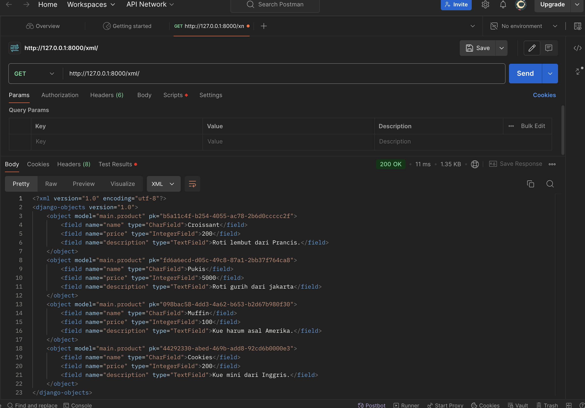
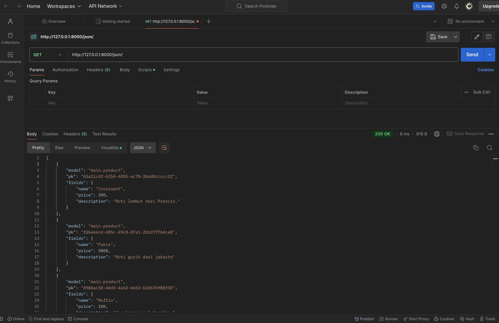
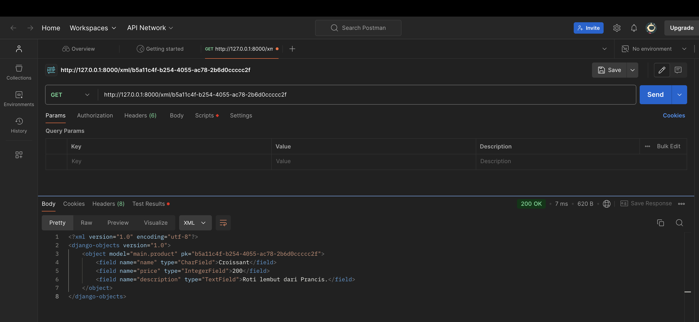
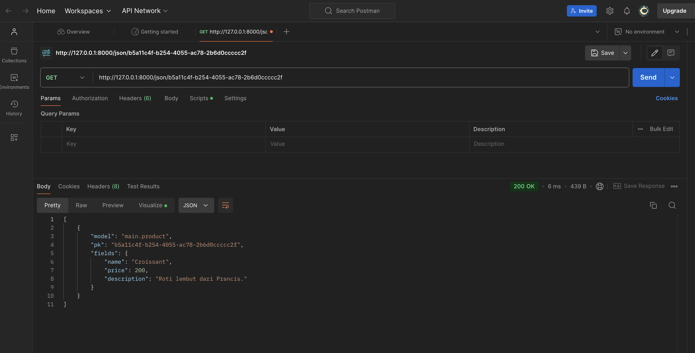

[Pertanyaan Tugas-Tugas]

----------------------Tugas 2---------------------------------------
1. tautan menuju PWS : "http://irfan-rizqi31-pacilbakery.pbp.cs.ui.ac.id"

2. Jelaskan bagaimana cara kamu mengimplementasikan checklist di atas secara step-by-step (bukan hanya sekadar mengikuti tutorial)

jawaban :

step 1 : membuat direktori lokal dahulu
step 2 : menginisiasi dan mengaktifkan virtual environment
step 3 : membuat project
step 4 : membuat app 'main'
step 5 : menambahkan app 'main' pada INSTALLED_APPS pada settings.py yang ada di project
step 6 : membuat class pada models serta atributnya
step 7 : make migrations dan migrate
step 8 : pada direktori app, membuat folder templates yang berisi file html yang akan digunakan pada views.py
step 9 : mengubah views.py = merender file html yang akan dijadikan template 
step 10 : membuat urlrouting (membuat urls.py pada direktori app + meng-include url tersebut pada file urls.py di project)
step 11 : melakukan proses CI git (membuat remote repo, git init, git remote add, git add, git commit, push ke remote repo)
step 12 : deploy ke PWS deh

3. Buatlah bagan yang berisi request client ke web aplikasi berbasis Django beserta responnya dan jelaskan pada bagan tersebut kaitan antara urls.py, views.py, models.py, dan berkas html.

Request
   ↓
Middleware (pre-processing)
   ↓
URL Routing → menentukan/memilah View yang Sesuai dengan request
   ↓
View → menjalankan logika
   ↓
Models ↔ Database (Ambil/Simpan Data)
   ↓
View → mengambil template html untuk ditampilkan,
   ↓
Middleware (post-processing)
   ↓
Response
   ↓
Client

4. Jelaskan fungsi git dalam pengembangan perangkat lunak!

jawaban : git memungkinkan pengembang perangkat lunak untuk berkolaborasi dan mencatat versi dari kode yang dikembangkan (version control system). Dengan git, pengembang dapat meminimalisir konflik yang akan terjadi pada saat real time collaboration pada suatu tim. Git juga memungkinkan pengembang untuk kembali pada kode sebelumnya saat kode tersebut tidak layak untuk diunggah sehingga perbaikan bug dan fixing problem akan lebih efektif.

5. Menurut Anda, dari semua framework yang ada, mengapa framework Django dijadikan permulaan pembelajaran pengembangan perangkat lunak?

jawaban : Salah satu yang paling menonjol dari Django Framework adalah community support. Dengan menggunakan framework Django, kita dapat dengan mudah belajar dari sumber yang tak terbatas di internet karena kepopulerannya yang tinggi. Selain itu, dokumentasi django sangat lengkap sehingga cocok bagi pemula untuk mempelajari lebih dalam terkait fitur, sintaks, serta alur kerja dari komponen-komponen pada django.

6. Mengapa model pada Django disebut sebagai ORM?

jawaban : karena Django menggunakan pendekatan ORM untuk menghubungkan model dengan database relasional. ORM memungkinkan pengembang untuk bekerja dengan data dalam bentuk objek daripada menulis query secara langsung, sehingga memudahkan interaksi dengan basis data tanpa harus memahami atau menulis kode SQL.

-------------------Tugas 3----------------------------
7. Jelaskan mengapa kita memerlukan data delivery dalam pengimplementasian sebuah platform?

Jawaban: Data delivery (pengiriman data) sangat penting dalam pengimplementasian sebuah platform dengan memastikan informasi atau layanan yang dikeluarkan oleh platform dapat diakses dengan tepat, cepat, dan efisien oleh pengguna. 

8. Menurutmu, mana yang lebih baik antara XML dan JSON? Mengapa JSON lebih populer dibandingkan XML?

Jawaban: JSON dianggap lebih baik dan lebih populer daripada XML karena formatnya yang lebih sederhana, mudah dipahami, dan muah diproses baik oleh mesin maupun manusia. Dengan struktur yang berbasis objek, JSON lebih cocok untuk bahasa pemrograman modern seperti JavaScript, sehingga lebih efisien dalam pertukaran data di web. Meskipun begitu, XML memiliki keunggulan dalam menangani data yang lebih kompleks dengan skema dan validasi, JSON yang lebih ringan dan cepat membuatnya lebih sering digunakan dalam pengembangan web dan API.

9. Jelaskan fungsi dari method is_valid() pada form Django dan mengapa kita membutuhkan method tersebut?

Jawaban: Method `is_valid()` pada form Django digunakan untuk memeriksa apakah data yang dimasukkan sesuai dengan aturan validasi yang telah ditentukan. Jika valid, method ini mengembalikan `True` dan menghasilkan `cleaned_data` yang dapat diproses lebih lanjut, sementara jika tidak valid, akan mengembalikan `False` dan menyimpan pesan kesalahan di atribut `errors`. Method ini penting untuk memastikan hanya data yang valid yang diproses oleh aplikasi.

10. Mengapa kita membutuhkan csrf_token saat membuat form di Django? Apa yang dapat terjadi jika kita tidak menambahkan csrf_token pada form Django? Bagaimana hal tersebut dapat dimanfaatkan oleh penyerang?

Jawaban : `csrf_token` diperlukan dalam form di Django untuk melindungi aplikasi dari Cross-Site Request Forgery (CSRF), yaitu serangan yang mencoba mengeksploitasi sesi pengguna dengan mengirimkan permintaan berbahaya yang terlihat sah. Tanpa `csrf_token`, form dapat menjadi sasaran serangan ini, di mana penyerang bisa menggunakan sesi pengguna untuk melakukan tindakan yang tidak diinginkan, seperti mengubah data atau melaksanakan transaksi tanpa izin. `csrf_token` memastikan bahwa setiap permintaan form berasal dari sumber yang sah dan bukan dari situs lain.

11.  Jelaskan bagaimana cara kamu mengimplementasikan checklist di atas secara step-by-step (bukan hanya sekadar mengikuti tutorial).

Jawaban : 
Step 1 : buatlah direktori templates pada direktori utama project dan tambahkan base.html di dalamnya, serta modifikasi BASE_DIRS
Step 2 : modifikasi models.py dan import uuid
Step 3 : migrasi basis data
Step 4 : buatlah forms untuk memasukkan data pada komponen-komponen data yang sudah ditentukan pada models (seperti name, price, description)
Step 5 : buatlah fungsi untuk mengembalikan data dengan format XML
Step 6 : buatlah fungsi untuk mengembalikan data dengan format JSON
Step 7 : buatlah fungsi untuk mengembalikan data XML filtered by id
Step 8 : buatlah fungsi untuk mengembalikan data JSON filtered by id
Step 9 : Modifikasi urls dengan menambahkan path path yang bersesuaian.
Step 10 : Runserver dan lakukan proses git

11. Mengakses keempat URL di poin 2 menggunakan Postman, membuat screenshot dari hasil akses URL pada Postman, dan menambahkannya ke dalam README.md.

sekian terima kasih!
